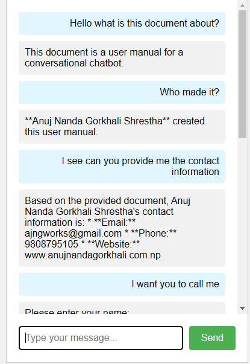
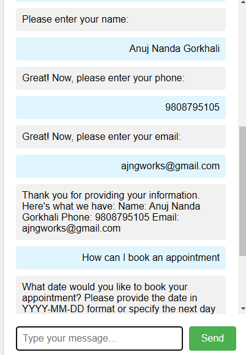
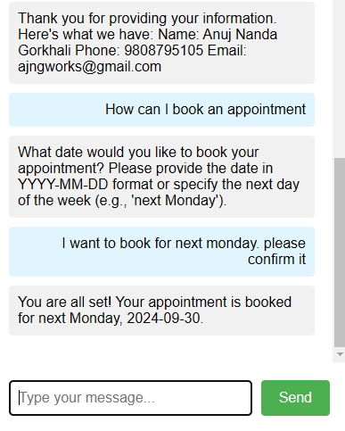

Personal Document ChatBot User Manual

Version: 1.0

Date: September 22, 2024

Developer: Anuj Nanda Gorkhali Shrestha

Table of Contents

- Introduction
- System Requirements
- Installation Guide
- Key Features
- Using the Chatbot
- Troubleshooting
- Contact Support

1. Introduction
This user manual is designed to help you use the conversational chatbot powered by the Langchain framework and integrated with a large language model (LLM). The chatbot can answer questions, retrieve information from documents, and assist with booking appointments.

2. System Requirements
To use the chatbot system, ensure that your system meets the following requirements:

- Operating System: Windows, macOS, or Linux
- Python Version: Python 3.8 or above
- Memory: At least 8GB of RAM (recommended)
- Internet Connection: Required for API calls to the LLM

3. Installation Guide
- Step 1: Clone the Repository
  - To get started, clone the repository containing the chatbot code. Open a terminal and run the following command:

              git clone https://github.com/xAJNGx/personaldocumentchatbot.git
              cd chatbot
    
- Step 2: Set Up a Virtual Environment
  - It is recommended to use a virtual environment for managing dependencies. Run the following commands:

          python3 -m venv venv
          On Windows: venv\Scripts\activate
    
- Step 3: Install Required Dependencies
  - Next, install the required Python libraries:
    
           pip install -r requirements.txt
   
- Step 4: Set Up Environment Variables
  - You will need to set up environment variables for the LLM API key (e.g., Google Gemini). Add your API key to an .env file in the root of the project:

          GEMINI_API_KEY=your_api_key_here
         
- Step 5: Set Application Default Credentials (ADC)
  - Type the following the terminal to set the credentials. You can get these by create a new project -> enable api -> create Service Account -> Create service account new key . You will get the json file.

             set GOOGLE_APPLICATION_CREDENTIALS=__.json
    
- Step 5: Run the Chatbot
  - Once the environment is set up, you can start the chatbot by running:

             python chatbot.py

4. Key Features
- Conversational Context: The chatbot maintains the context of your conversations, ensuring a more natural, flowing interaction.

- Document Retrieval: The chatbot can search through and retrieve information from uploaded documents (e.g., .txt files).

- Appointment Booking: Users can schedule appointments using natural language commands like “Book an appointment for next Monday.”

- Custom Tools: The chatbot has built-in tools, such as one for booking appointments, and can be extended with new functionalities.

5. Using the Chatbot
- General Interaction
  - To start a conversation with the chatbot, type a message and press enter. The chatbot will respond with helpful information or a follow-up question. Examples of questions you can ask:

- General Inquiry:
  - “What is the capital of France?”

- Document Search:
  - “Can you find information about [topic] in the uploaded document?”

- Appointment Booking:
  - “Book an appointment for next Friday.”

-Form Handling
  -You can also enter personal details like name, phone, and email in a conversational form. The chatbot will guide you through the process, asking for each field in turn.

6. Troubleshooting

Common Issues
- Issue 1: API Key Not Found
  - Solution: Make sure you have added the correct API key to your .env file in the project’s root directory.

- Issue 2:Google Application Credentials
  - Solution: Make sure you have set the google application credentials: set GOOGLE_APPLICAITON_CREDENTIALS= __.json

- Issue 3: The chatbot is not responding
  - Solution: Ensure your internet connection is stable and that the LLM API service is up and running.

- Issue 4: Errors in fetching documents
  - Solution: Ensure that the document directory path is correct, and that the documents are in .txt format. The chatbot currently supports text files only.

- Debugging
  - To enable verbose logging, you can modify the agent_executor to include verbose=True and inspect what actions the chatbot is taking when processing inputs.

7. Contact Support

 If you encounter any issues or need further assistance, please contact our support team:

 - Email: ajngworks@gmail.com
 - Phone: 9808795105
 - Website: www.anujnandagorkhali.com.np

